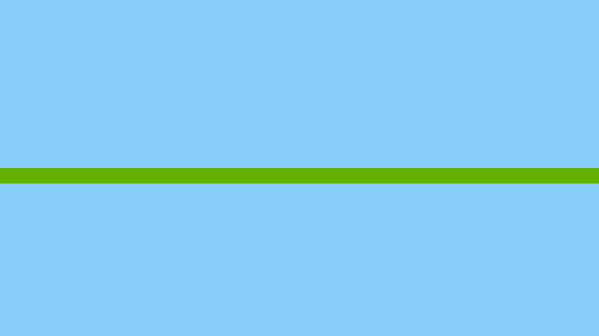
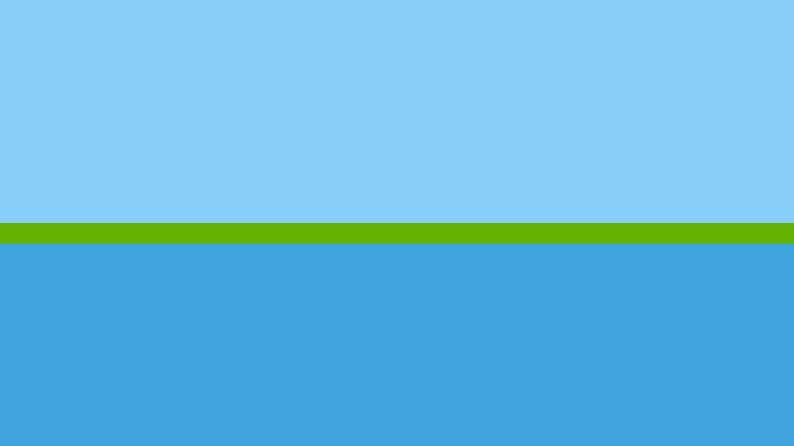
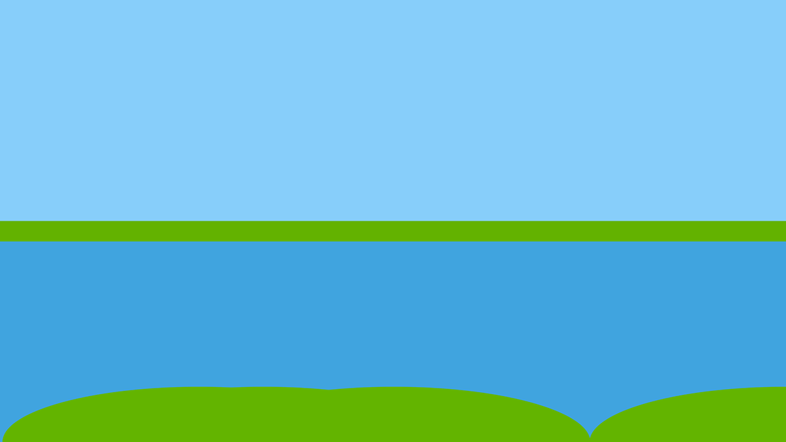
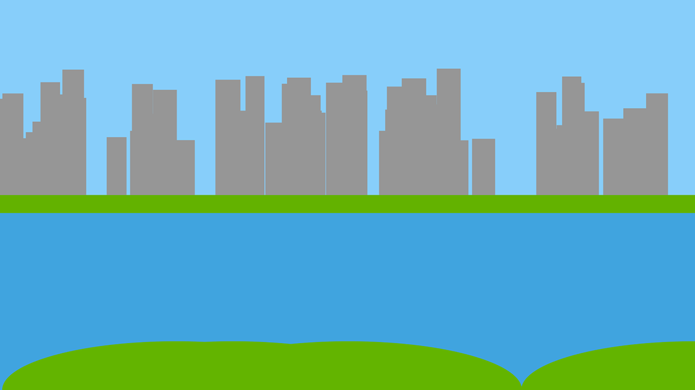
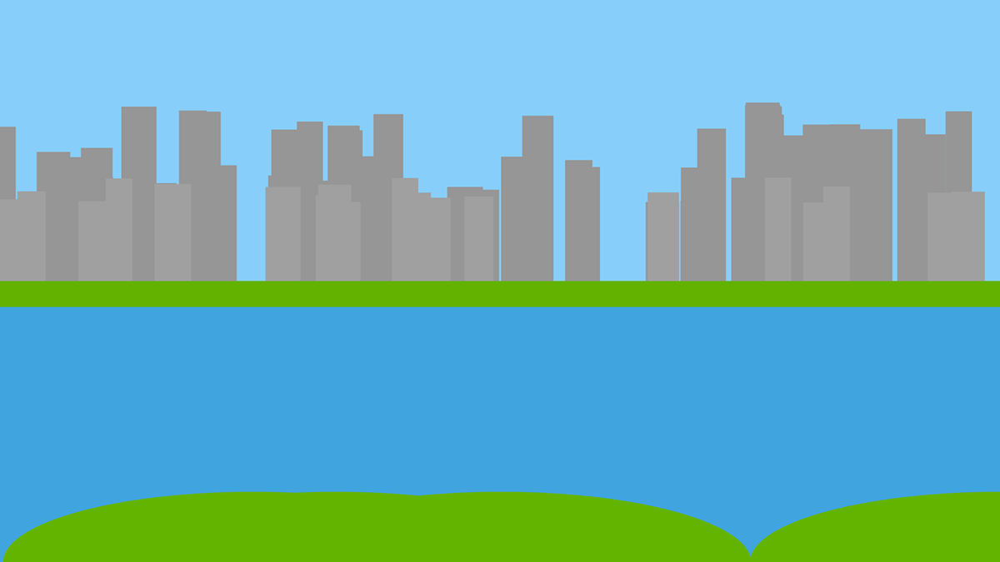
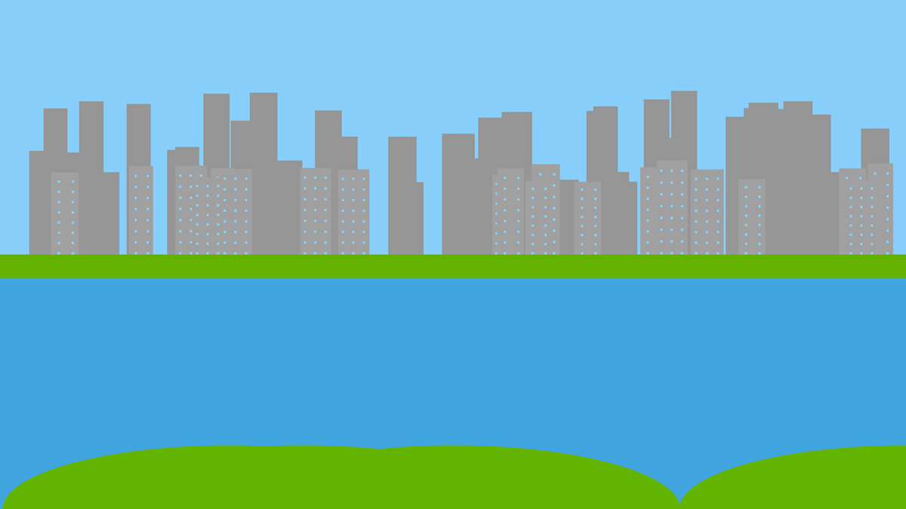
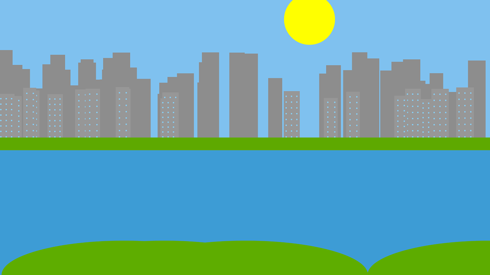
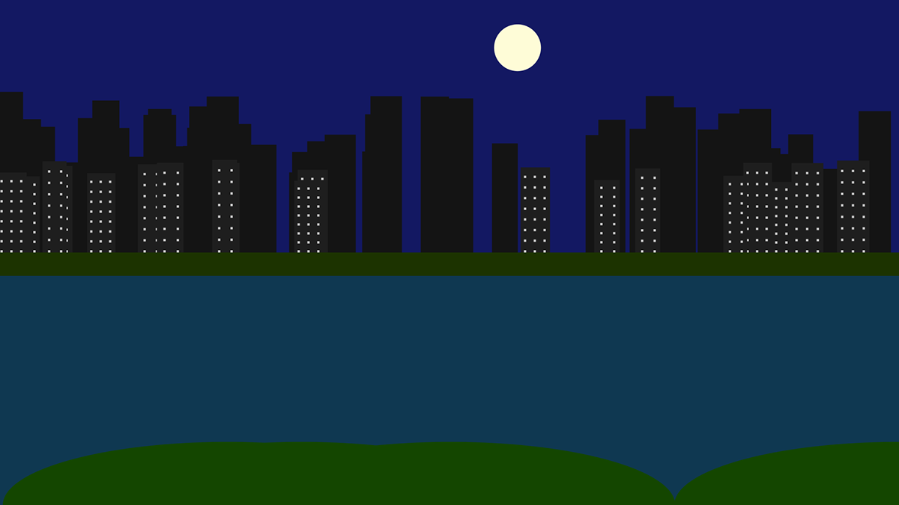
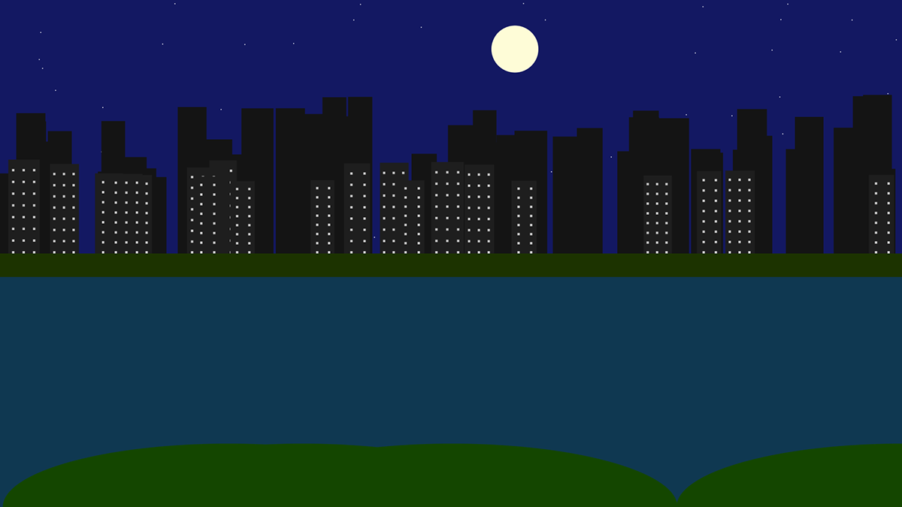

# The City near the River

## Breakdown

This sketch was created in Processing for a mid-semester course project. The objective of this project is to create a larger sketch composition based on what we've learned so far in the course.

Starting with the sky

Drew a piece of land for the buildings

Drew a river

Added more land in the foreground

Randomly set positions and dimensions of background buildings

Drew shorter buildings in the foreground

Added windows based on the width of each foreground building

Added the sun

Added the moon. Every color in the sketch changes based on the position of the sun and moon.

Users can press 's' to display stars (tiny white pixels) during the night

